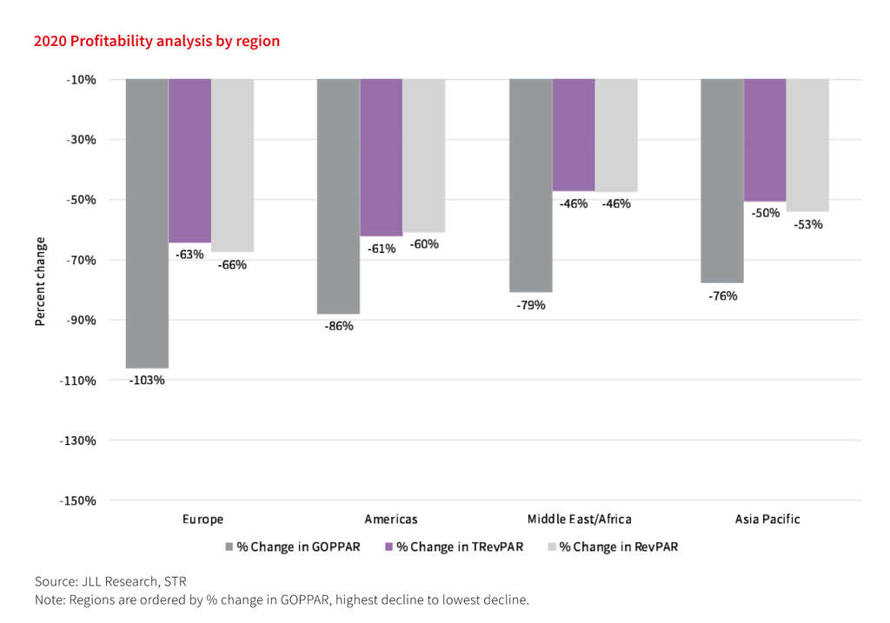

# This week in Hospitality & Tourism:

- [New COVID-19 Surges Keep Travel Restrictions in Place](https://www.hospitalitynet.org/news/4107758.html)

  One out of five destinations continue to have their borders completely closed as new surges of COVID-19 impact the restart of international tourism. The latest research shows that still 98% of all destinations have some kind of travel restrictions in place.

- [Trending in Travel Report by Trip.com & WTTC](https://www.hospitalitynet.org/news/4107747.html)

  Highlights from the report:

  - Sustained domestic rediscovery: As international travel restrictions continue, travellers are looking at domestic experiences.
  - Preference for longer stays: One in four global travellers stayed ten or more nights during their travels.
  - A new wave of travelers: Flexible bookings, easier cancellation, and shorter booking windows highlight the current traveller trends.

- [JLL's Hotels & Hospitality Global Asset Management report 2021](https://www.hospitalitynet.org/news/4107753.html)

  The global COVID-19 health crisis has had a drastic and immediate impact on hotels, with operating performance reaching record lows across the world.
  

-
